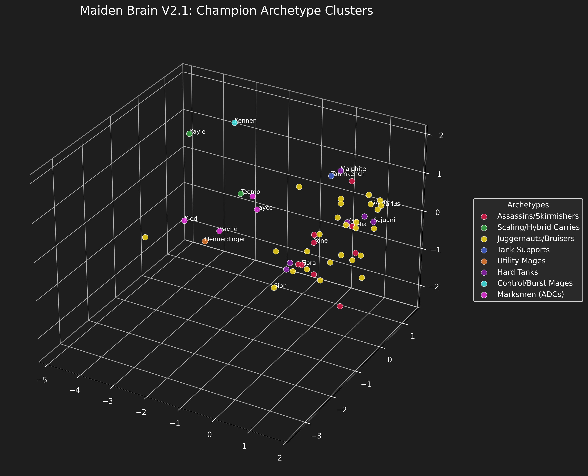

lol item reccomender and rune picker 

lookup table for rune picker

MLP for item recomemder 

optimisations/tweaks:
 - only trained off yorick games 
 - only picks legendary items
 - only recommends items that the yoricks picked in the trained matches (31 in total main items )
 

notable inputs /features :
- a vector that represent how compeleted each item is to allow commitment to an item long-term
- what main rune ur using 
- current inv
- ur top lane matchup archetype 
- number to represent if ur behind or snowballing to better pick items in real time

overlay to help pick items for yorick top

